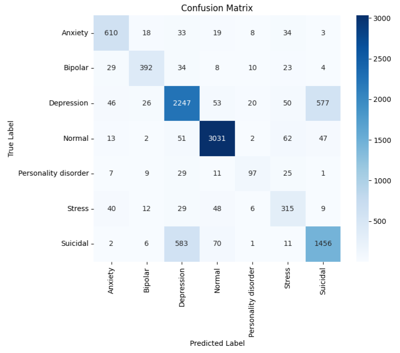
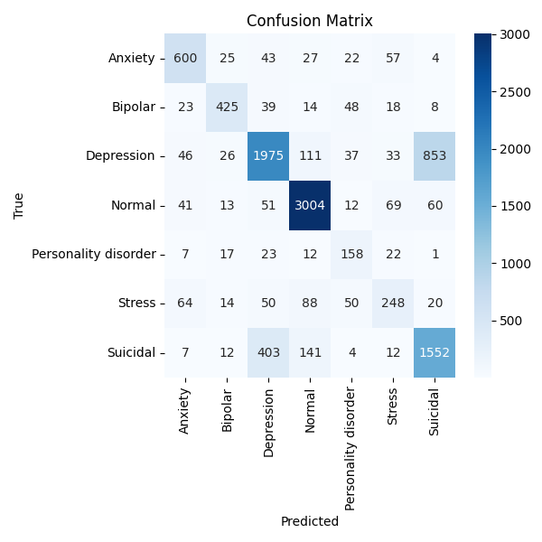

#  EMOLEX: Emotion and Language Exploration for Mental Health<br>


A mental health sentiment classification project using NLP to detect psychological states from short text. This project explores multiple models — from classical baselines to LSTMs and transformers — to identify sentiments such as Anxiety, Depression, Suicidal Ideation, Stress, Bipolar Disorder, Personality Disorder, and Normal from user-generated text.

## 📌 Project Description

The goal of EMOLEX is to develop a multi-class classifier that predicts the mental health condition underlying a given text statement. 

The project benchmarks include:

- **Transformer Models** (DistilBERT, BERT)
- **LSTM Models** (BiLSTM, LSTM)
- **Classical ML Models** (LR, SVM)

We aim to better understand the performance trade-offs between accuracy and efficiency across model types while enabling mental health research through NLP.

## 📁 Repository Structure

This project is organized to provide a clear separation of concerns, with dedicated directories for data, source code, and configuration.

```bash
NLP_Project/
├── LICENSE                           # MIT License.
├── README.md                         # Repository overview and setup.
├── pyproject.toml                    # Project configuration.
├── requirements.txt                  # Project dependencies.
├── data/                             # Project datasets.
├── documents/                        # Documentation, architecture, research notes.
├── experiments/                      # Experiment notebooks.
├── figures                           # Performance plots.
└── src/                              # Contains the core source code.
    └── emolex/                       # The main package for the project.
```

## 🚀 Getting Started

### 1. Clone the Repository
```bash
git clone https://github.com/<your-username>/NLP_Project.git
cd NLP_Project
```

### 2. Create a Virtual Environment
```bash
conda create -n nlp_project python=3.10
conda activate nlp_project
```

### 3. Install the Package and Dependencies
```bash
# Ensure you are at the top-level of the NLP_project repository
pip install -e .
```

### 4. Download NLTK Data
The preprocessing.py module uses NLTK's stopwords and WordNet lemmatizer. You'll need to download these datasets once:
```bash
# Ensure your virtual environment is active
python -c "import nltk; nltk.download('stopwords'); nltk.download('wordnet'); nltk.download('omw-1.4')"
```

### 5. Verify Installation
Verify that the emolex package is importable:
```bash
# Ensure your virtual environment is active
python -c "import emolex; print('emolex imported successfully')"
```

## 🧪 Models & Evaluation
- ✅ Transformers: DistilBERT, BERT
- ✅ LSTMs: LSTM, BiLSTM
- ✅ Classical ML: TF-IDF + LR, TF-IDF + SVM 
- 🔎 Evaluation: Accuracy, Macro F1, Precision/Recall, Confusion Matrix, Training Time

## 📊 Performance Benchmarks

Here is a comparative summary of the performance across models.

Model        | Accuracy | Precision | Recall | F1 Score | Training Time  
-------------|----------|-----------|--------|----------|---------------
BERT         |  0.81    | 0.78      | 0.78   | 0.78     | High (~600 s/epoch) 
DistilBERT   |  0.80    | 0.73      | 0.80   | 0.75     | Medium (~300 s/epoch) 
BiLSTM       |  0.77    | 0.72      | 0.69   | 0.70     | Low (~40 s/epoch) 
LSTM         |  0.75    | 0.70      | 0.67   | 0.68     | Medium (~240 s/epoch) 
TF-IDF + LR  |  0.76    | 0.74      | 0.67   | 0.70     | Very Low (~21s total) 
TF-IDF + SVM |  0.75    | 0.73      | 0.70   | 0.71     | Very Low (~16s total)  

Here are the confusion matrices for each model, showing the categories where each excels vs. struggles.

<table cellspacing="0px" cellpadding="0px">
    <tr>
        <th>DistilBERT</th>
        <th>BERT</th>
    </tr>
    <tr>
        <td></td>
        <td></td>
    </tr>
    <tr>
        <th>BiLSTM</th>
        <th>LSTM</th>
    </tr>
    <tr>
        <td></td>
        <td></td>
    </tr>
    <tr>
        <th>TF-IDF + LR</th>
        <th>TF-IDF + SVM</th>
    </tr>
    <tr>
        <td></td>
        <td></td>
    </tr>
</table>

## 📄 License
MIT License — feel free to use, share, and modify.

## 🤝 Contributing
Pull requests welcome! For major changes, please open an issue first to discuss what you’d like to change.

## 🧠 Project Maintainers
- [Jiajin Zhou]
- [Jie Lian]
- [Peter Mink]
- [Curtis Neiderer]
- Contributors welcome!
